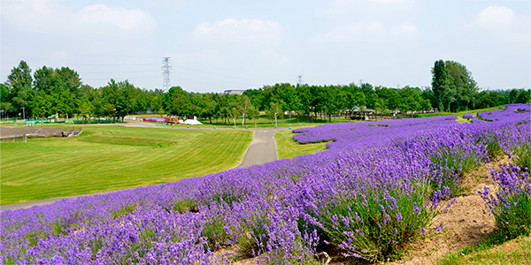
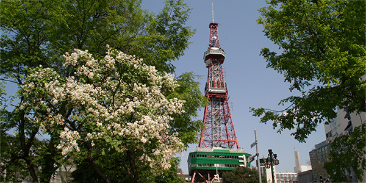

___News: The program is open!___
___News: Now, the registration form is open!___

# AQIS2024 satellite workshop
{:style="display: none;"}



  <!--
  <a href="#slide-1">1</a>
  <a href="#slide-2">2</a>
  <a href="#slide-3">3</a>
  <a href="#slide-4">4</a>
  <a href="#slide-5">5</a>
  -->
 
  

    

      
    

    

      
    

    

      
    

    

      
    

    

      
    

  

  <a href="#slide-1">1</a>
  <a href="#slide-2">2</a>
  <a href="#slide-3">3</a>
  <a href="#slide-4">4</a>
  <a href="#slide-5">5</a>
  



<!-- {:style="display: block; margin: auto;"} -->

## About the Workshop
The AQIS2024 satellite workshop aims to foster collaboration and exchange ideas among researchers and professionals at the intersection of theory, experiment, and architecture toward building fault-tolerant quantum computers.
This event serves as a platform to discuss the latest advancements, tackle the challenges, and identify new directions in the field of quantum information science. Participants will have the opportunity to engage in in-depth discussions, share their insights, and explore potential collaborative projects.

## Date and Venue
- __Date:__ August 31st (Sat.), 2024
- __Venue:__ Sapporo City Gender Equality Center  
  Sapporo L-Plaza, Kita 8-jo Nishi 3-chome, Kita-ku, Sapporo, Hokkaido, 060-0808 Japan


<iframe src="https://www.google.com/maps/embed?pb=!1m14!1m8!1m3!1d23316.876998813346!2d141.33911299993122!3d43.07067726432903!3m2!1i1024!2i768!4f13.1!3m3!1m2!1s0x5f0b290b765d2cb9%3A0x92fb31b5c3ca80e7!2z5pyt5bmM44Ko44Or44OX44Op44K2!5e0!3m2!1sja!2sjp!4v1711955791887!5m2!1sen!2sjp" width="600" height="350" style="border:0;" allowfullscreen="" loading="lazy" referrerpolicy="no-referrer-when-downgrade" style="display: block; margin: auto;"></iframe>


## Program
The workshop will feature a series of keynote speeches, a panel discussion, and a poster session, allowing participants to delve into various aspects of quantum information science.
The program is designed to cater to a diverse audience, including researchers, practitioners, and students.
__Program is [here](program.md)!__

### Confirmed speakers
- Warit Asavanant (The University of Tokyo)
- Poulami Das (The University of Texas at Austin)
- Thinh Le (University of Technology Sydney)
- Ting-Chun Lin (University of California San Diego)

## Registration
___Please Register [here](https://forms.office.com/r/aBzvTxyC93)!!!___
- No registration fee is required.
- We will accept up to 20 poster presentations in the poster session. Please enter your poster information in the registration form by __Aug. 10th__. Notification will be sent by Aug. 16th.
- The registration deadline for the evening social event is __Aug. 10th__.

## Host
Committees on AQIS2024 Satellite Workshop on Fault-Tolerant Quantum Computing

### Organizing committee
- Teruo Tanimoto (Kyushu University)
- Yasunari Suzuki (Nippon Telegraph and Telephone Corporation)
- Shota Nagayama (Mercari, Inc. / Keio University)
- Hayata Yamasaki (The University of Tokyo)
- Akihito Soeda (National Institute of Informatics, Research Organization of Information and Systems)
- Yuta Mizuno (Hokkaido University)

### Steering comittee
- Akihisa Tomita (Hokkaido University)
- Shigeru Yamashita (Ritsumeikan University)
- Koji Inoue (Kyushu University)

## Endorsed by (alphabetical):
- Koashi Project, JST Moonshot Program Goal 6
- Nagayama Project, JST Moonshot Program Goal 6
- Yamamoto (Tsuyoshi) Project, JST Moonshot Program Goal 6
